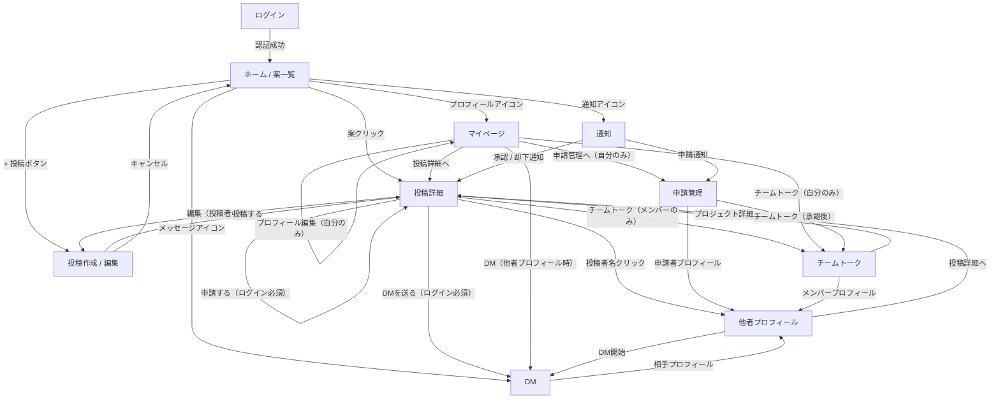

# 画面設計

## 前提・用語定義

| 用語 | 定義 |
|------|------|
| プロジェクト | ユーザーが投稿するプロダクトアイデア（案） |
| ポジション | プロジェクト内の募集役割（例: フロントエンド、デザイナー） |
| 気になる | プロジェクトを保存・フォローするアクション |
| チームトーク | プロジェクト作成時に自動生成されるグループチャンネル |
| feature | 求める人物像タグ（例: 初心者OK、テックリード歓迎） |

---

## 画面一覧

| # | 画面名 | アクセス権限 |
|---|--------|------------|
| 1 | ホーム / 案一覧 | 全員（ゲスト可） |
| 2 | 投稿詳細 | 全員（ゲスト可） |
| 3 | 投稿作成 / 編集 | ログイン必須 |
| 4 | マイページ / 他者プロフィール | 全員（一部はログイン必須） |
| 5 | 申請管理 | ログイン必須（投稿者のみ） |
| 6 | DM | ログイン必須 |
| 7 | チームトーク | ログイン必須（メンバーのみ） |
| 8 | 通知 | ログイン必須 |
| 9 | ログイン | 未ログイン時 |

---

## 画面遷移図

---

## 各画面仕様

### 1. ホーム / 案一覧

プロジェクト案の一覧を表示するトップページ。

**表示情報**
- プロジェクトカード（一覧表示）
  - タイトル
  - 概要（冒頭数行）
  - ポジションのカテゴリ（代表的なもの）
  - 技術スタックタグ（代表的なもの）
  - 気になる数
  - 募集状況（募集中 / 締切）
  - 投稿日時

**アクション**

| アクション | 条件 |
|-----------|------|
| カードクリック → 投稿詳細 | 全員 |
| 気になるボタン | ログイン必須 |
| 並び順変更（新着順 / 気になる順） | 全員 |
| 新規投稿ボタン | ログイン必須 |

**遷移先**
- 投稿詳細
- 投稿作成
- ログイン（未ログイン時に制限アクションを実行しようとした場合）

---

### 2. 投稿詳細

プロジェクトの詳細情報を確認し、参加申請を行う画面。

**表示情報**
- プロジェクト基本情報
  - タイトル
  - 概要 / ビジョン
  - 稼働期間（週n時間以上など）
  - 気になる数 / ボタン
  - 募集状況（募集中 / 締切）
  - 投稿者（アイコン + 表示名、クリックでプロフィールへ）
- ポジション一覧（複数）
  - ポジション名（カテゴリ）
  - 技術スタックタグ
  - 求める人物像（feature）
  - このポジションの募集状況
  - 申請ボタン

**アクション**

| アクション | 条件 |
|-----------|------|
| 気になるボタン | ログイン必須 |
| ポジション申請ボタン → 申請モーダル（メッセージ入力） | ログイン必須、自分の投稿は不可 |
| 投稿者へDM | ログイン必須 |
| 投稿編集 | 投稿者本人のみ |
| 募集終了にする | 投稿者本人のみ |
| チームトークへ | プロジェクトメンバーのみ |

**遷移先**
- 他者プロフィール（投稿者名クリック）
- DM
- チームトーク
- 投稿作成 / 編集（本人のみ）

---

### 3. 投稿作成 / 編集

プロジェクト案を作成・編集するフォーム画面。

**入力フィールド**

プロジェクト（親）:

| フィールド | 必須 | 説明 |
|----------|------|------|
| タイトル | 必須 | プロジェクト名 |
| 概要 / ビジョン | 必須 | 何を作るか・なぜ作るか |
| 稼働期間 | 任意 | 週n時間以上など |

ポジション（子、複数追加可）:

| フィールド | 必須 | 説明 |
|----------|------|------|
| カテゴリ | 必須 | フロントエンド / バックエンド / デザイナー 等 |
| 技術スタックタグ | 任意 | React, TypeScript 等 |
| 求める人物像（feature） | 任意 | 初心者OK / テックリード歓迎 等 |

**アクション**

| アクション | 条件 |
|-----------|------|
| 投稿する | 1つ以上のポジションが存在する場合 |
| ポジション追加 / 削除 | 常時 |
| 投稿削除 | 投稿者本人かつ編集時のみ |
| キャンセル | 常時 |

**遷移先**
- 投稿詳細（投稿後）
- ホーム（キャンセル）

---

### 4. マイページ / 他者プロフィール

自分または他者のプロフィールと活動情報を表示する画面。

**表示情報（共通）**

| 情報 | 自分 | 他者 |
|------|------|------|
| アイコン画像 | ○ | ○ |
| 表示名 | ○ | ○ |
| 自己紹介 | ○ | ○ |
| スキルタグ | ○ | ○ |
| GitHub / SNS リンク | ○ | ○ |
| 投稿したプロジェクト一覧 | ○ | ○ |
| 参加中プロジェクト一覧 | ○ | ○ |
| 気になり一覧 | ○ | ✗ |

**アクション**

| アクション | 条件 |
|-----------|------|
| プロフィール編集 | 自分のみ |
| 申請管理へ | 自分のみ |
| DMを送る | 他者プロフィール、ログイン必須 |
| 投稿詳細へ | 全員 |

**遷移先**
- 投稿詳細
- 申請管理（自分のみ）
- DM（他者プロフィール）

---

### 5. 申請管理

自分のプロジェクトに届いた参加申請を確認・承認 / 却下する画面。

**表示情報**
- プロジェクト別・ポジション別に申請一覧
  - 申請者（アイコン + 表示名）
  - 申請ポジション
  - 申請メッセージ
  - 申請日時
  - ステータス（未対応 / 承認済み / 却下済み）

**アクション**

| アクション | 条件 |
|-----------|------|
| 承認 | 未対応のみ |
| 却下 | 未対応のみ |
| 申請者プロフィールへ | 全申請 |

**遷移先**
- 他者プロフィール（申請者クリック）
- チームトーク（承認後のリンク）

---

### 6. DM

1対1のダイレクトメッセージ画面。ログイン済みなら誰とでも開始できる。

**表示情報**
- 会話一覧（サイドバー or トップ）
  - 相手のアイコン + 表示名
  - 最新メッセージのプレビュー
  - 未読バッジ
- 会話詳細
  - メッセージ履歴（時系列）
  - 送信フォーム

**アクション**

| アクション | 条件 |
|-----------|------|
| メッセージ送信 | ログイン必須 |
| 相手プロフィールへ | ログイン必須 |

**遷移先**
- 他者プロフィール

---

### 7. チームトーク

プロジェクトごとのグループチャット画面。プロジェクト作成と同時に自動生成される。

**表示情報**
- チャンネル一覧（参加プロジェクト分）
  - プロジェクト名
  - 未読バッジ
- チャンネル詳細
  - メッセージ履歴（時系列）
  - 参加メンバー一覧
  - 送信フォーム

**メンバー管理**
- 作成時: 投稿者のみ
- 申請が承認されるたびに承認者が自動追加

**アクション**

| アクション | 条件 |
|-----------|------|
| メッセージ送信 | メンバーのみ |
| メンバープロフィールへ | メンバーのみ |
| プロジェクト詳細へ | メンバーのみ |

**遷移先**
- 他者プロフィール
- 投稿詳細

---

### 8. 通知

ユーザーへのシステム通知を一覧表示するパネル / ページ。

**通知トリガー**

| イベント | 通知対象 | リンク先 |
|---------|---------|---------|
| 参加申請が届いた | 投稿者 | 申請管理 |
| 申請が承認された | 申請者 | 投稿詳細 |
| 申請が却下された（理由なし） | 申請者 | 投稿詳細 |

**表示情報**
- 通知テキスト（「〇〇さんが フロントエンド ポジションに申請しました」等）
- 日時
- 未読 / 既読状態

---

### 9. ログイン

Google OAuth を使った認証画面（better-auth）。

**表示情報**
- サービスキャッチコピー（簡易）
- Google でログインボタン

**遷移先**
- ホーム（認証成功後）

---

## コンテンツモデルサマリ

### Project（プロジェクト）

| フィールド | 型 | 必須 |
|----------|---|------|
| id | string | ○ |
| title | string | ○ |
| description | text | ○ |
| commitment | string | ✗ |
| status | enum(open / closed) | ○ |
| ownerId | userId | ○ |
| createdAt | datetime | ○ |

### Position（ポジション）

| フィールド | 型 | 必須 |
|----------|---|------|
| id | string | ○ |
| projectId | string | ○ |
| category | string | ○ |
| techTags | string[] | ✗ |
| featureTags | string[] | ✗ |
| status | enum(open / closed) | ○ |

### Application（申請）

| フィールド | 型 | 必須 |
|----------|---|------|
| id | string | ○ |
| positionId | string | ○ |
| applicantId | userId | ○ |
| message | text | ○ |
| status | enum(pending / approved / rejected) | ○ |
| createdAt | datetime | ○ |

### User（ユーザー）

| フィールド | 型 | 必須 |
|----------|---|------|
| id | string | ○ |
| name | string | ○ |
| avatarUrl | string | ✗ |
| bio | text | ✗ |
| skillTags | string[] | ✗ |
| githubUrl | string | ✗ |
| snsUrl | string | ✗ |
